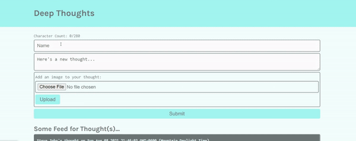

# aws-thoughts


## Description
An AWS application that allows users to share thoughts and quotes. User posts are stored to a DynamoDB database. Users may add an image to their post and store that image with Amazon Simple Storage Service (S3). This application is deployed to an Elastic Compute Cloud (EC2) instance.

## Table of Contents
* [Links](#links)
* [Animation](#animation) 
* [Instructions](#instructions) 
* [Installation](#installations) 
* [Tests](#tests)
* [Contribute](#contribute) 
* [Technologies](#technologies)  
* [License](#license)
* [Contact](#contact)

## Links
Published URL: [http://3.21.28.106/](http://3.21.28.106/)

Repository: [https://github.com/spencercreer/aws-thoughts](https://github.com/spencercreer/aws-thoughts)

## Animation
The following animation demonstrates the application functionality:
<br>

## Instructions
TBD
## Installation
To install necessary dependencies, run the following command:

  ```
  TBD
  ```
## Tests
To run tests, run the following command:

  ```
  TBD
  ```
    
## Contribute
Please submit a PR if you would like to contribute.

## Technologies
 * JavaScript
 * Express
 * React
 * AWS
 * S3
 * DynamoDB
 * EC2

## License
This project is licensed under the MIT license.

## Contact
For questions or comments, please contact me.

Email: <a href="mailto: spencercreer@gmail.com" target="_blank">spencercreer@gmail.com</a>

GitHub: [spencercreer](https://github.com/spencercreer/)
